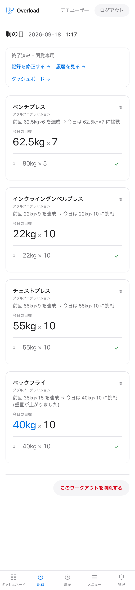
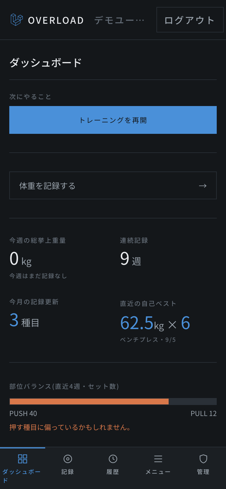
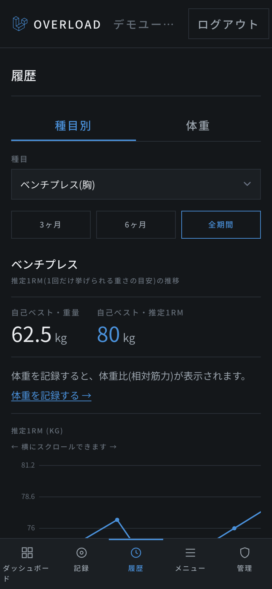
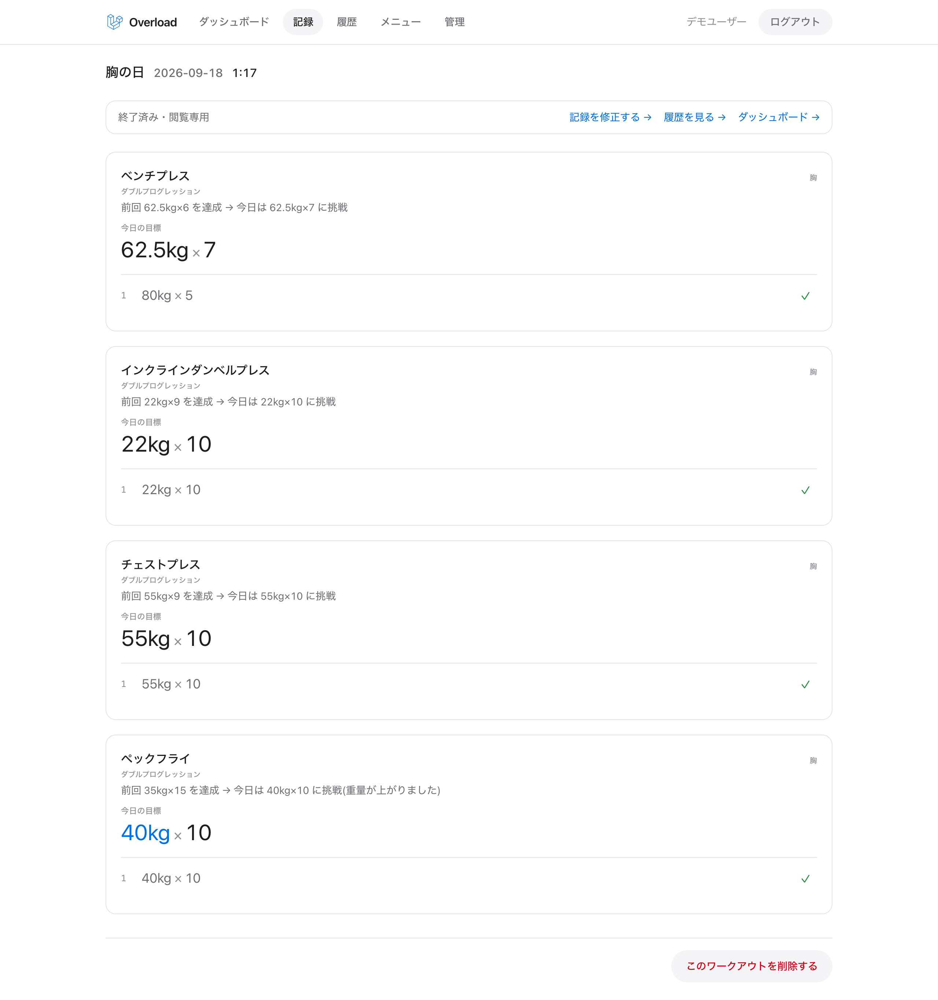
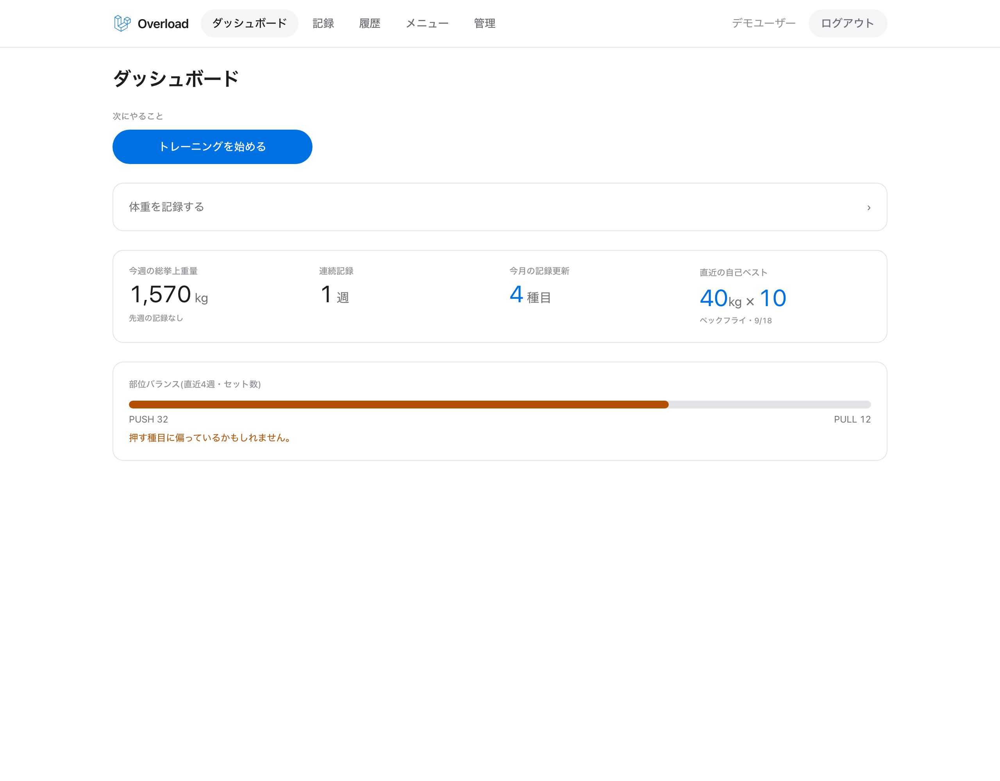
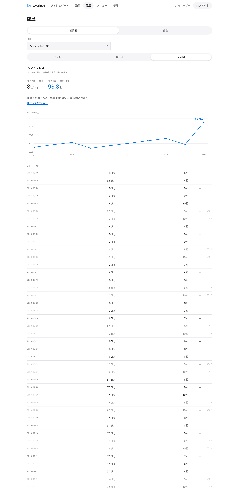
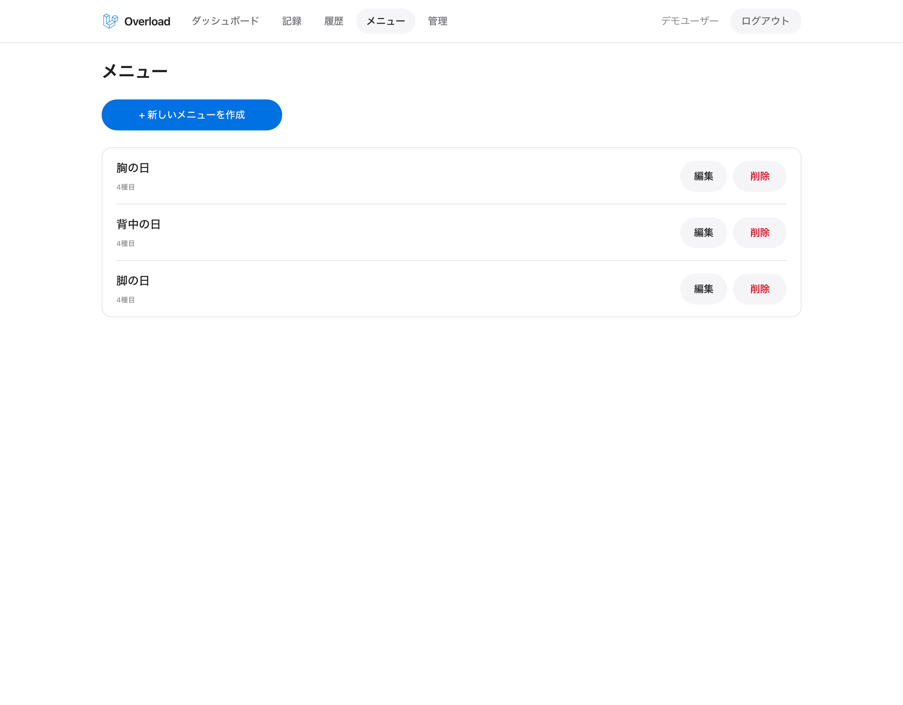

# Overload

**「今日は何kgを何回やればいいか」をアプリが先に出す筋トレ管理アプリ。**

既存の筋トレアプリの多くは「記録帳」で止まり、次に何をすべきかを教えてくれません。
Overload は前回の記録から今日の目標を計算し、入力欄にあらかじめ入れておきます。

| 特徴 | 内容 |
| --- | --- |
| 漸進的過負荷ナビ | 種目を開いた時点で、今日の目標重量と回数が表示されている |
| 入力の速さ | 目標値が入力済みなので、1セットの記録はタップ1回で終わる |

そのほかの機能は、ルーティン管理、履歴グラフ、休憩タイマー、体重記録、CSV出力、管理者画面です。

## スクリーンショット

| 記録画面(スマホ) | ダッシュボード(スマホ) | 履歴(スマホ) |
| --- | --- | --- |
|  |  |  |

PC 画面

## 学習項目とコードの対応

自己研鑽として学んだ内容を、このアプリのどこで使ったかをまとめています。
学習内容と所感の詳細は [学習記録](.claude/docs/learning-log.md) にあります。

### PHP

| 学習項目 | 使った場所 | 内容 |
| --- | --- | --- |
| クラス | [ProgressionService.php](app/app/Services/ProgressionService.php) | 今日の目標を計算するロジックを、DB に依存しないクラスとして切り出した |
| 継承 | [AbstractProgressionStrategy.php](app/app/Services/Progression/AbstractProgressionStrategy.php) | 3つの漸進法に共通する手順を抽象クラスにまとめ、各クラスは計算部分だけを実装する |
| ポリモーフィズム | [Progression/](app/app/Services/Progression/) | 漸進法をインターフェースで統一し、種目ごとの設定に応じて Factory が実装を切り替える |
| セッション管理 | [security.md §3](.claude/docs/security.md) | ログイン時のセッションID再生成と Cookie 属性を確認した |
| CSRF | [security.md §1](.claude/docs/security.md) | トークン無しの POST が拒否されることを確認した |
| XSS | [security.md §2](.claude/docs/security.md) | 種目名にスクリプトを登録し、実行されないことを確認した |
| SQLインジェクション | [security.md §4](.claude/docs/security.md) | 生SQLの使用箇所を洗い出し、プレースホルダで守られていることを確認した |

### JavaScript

| 学習項目 | 使った場所 | 内容 |
| --- | --- | --- |
| クラス・継承・ポリモーフィズム | [notifiers/](app/resources/js/Utils/notifiers/) | 休憩タイマーの通知を基底クラスにし、音・振動・画面表示の各クラスが継承する。呼び出し側は種類を意識せずに通知できる |

## 技術構成

| 種別 | 内容 |
| --- | --- |
| バックエンド | Laravel 13 / PHP 8.3 |
| フロントエンド | Inertia.js + Vue 3 |
| CSS | Tailwind CSS v4 |
| データベース | MySQL 8.0 |
| テスト | PHPUnit / Vitest |
| コード品質 | Laravel Pint / ESLint / Prettier |
| CI | GitHub Actions |
| 開発環境 | Docker Compose(nginx / php-fpm / MySQL / phpMyAdmin) |

## 開発の進め方

AIツールとして **Claude Code** を使い、設計から実装、テスト、レビューまでを進めました。

- **Issue 駆動:** 機能や修正を [Issue](https://github.com/reoreoreo0615-dotcom/myapp/issues?q=is%3Aissue) に分け、30件をすべてクローズしました。
- **作業記録:** 各 Issue の完了時に、実装内容と設計上の判断を記録しました。記録は Issue のコメントと [worklog](.claude/worklog/) に残しています。
- **テストと CI:** push のたびに、整形チェック、ビルド、テストを GitHub Actions で実行しています。

| テスト | 件数 |
| --- | --- |
| PHP(PHPUnit) | 385 |
| JavaScript(Vitest) | 70 |
| 合計 | 455 |

関連ドキュメント:

- [設計仕様書](.claude/docs/overload-spec.html) — DB設計、コアロジック、画面モック
- [セキュリティ検証](.claude/docs/security.md) — 対策済みの項目と、未対策の項目
- [開発規約](.claude/CLAUDE.md) — Claude Code に渡している開発ルール
